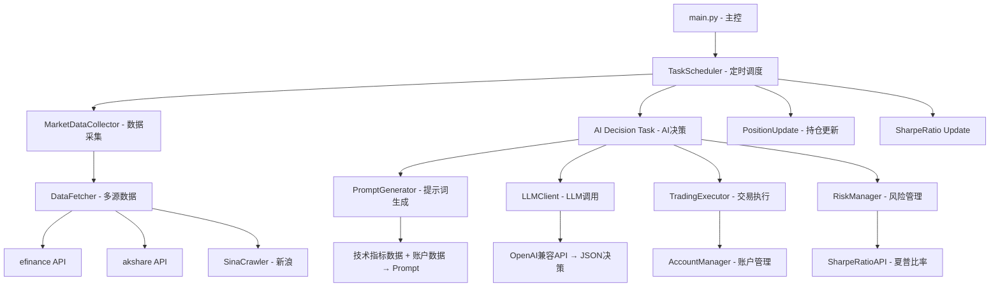
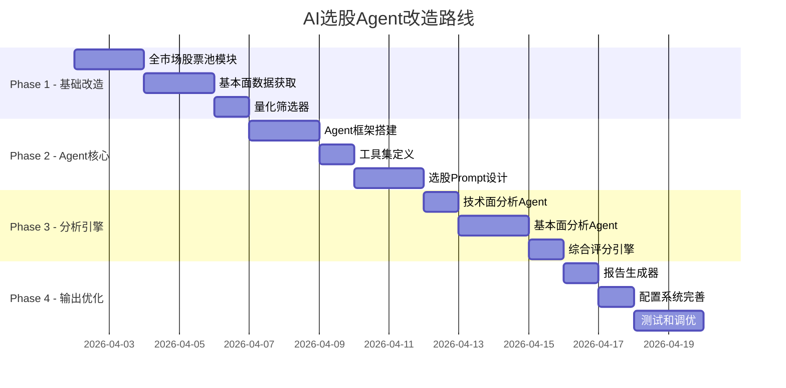

# LLM-TRADE 项目分析 & AI选股Agent改造方案

## 一、现有项目分析

### 1.1 项目定位
当前是一个 **A股ETF AI自主交易系统**，核心能力：
- 针对 **固定的6只ETF** 进行自动交易（黄金、芯片、新能源车、机器人、军工、人工智能）
- 基于技术指标 + LLM决策 → 自动执行买卖

### 1.2 架构总览



### 1.3 模块清单 & 代码量

| 模块 | 文件 | 大小 | 核心职责 |
|------|------|------|----------|
| 主入口 | `main.py` | 30KB/744行 | 系统初始化、流程编排、分层任务启动 |
| 数据获取 | `data_fetcher.py` | 45KB/1027行 | 多源ETF行情获取（efinance/akshare/新浪） |
| 新浪爬虫 | `sina_crawler.py` | 14KB | 新浪财经API爬取五档盘口 |
| 技术指标 | `indicators.py` | 20KB/573行 | EMA/MACD/RSI/KDJ/BOLL/WR/ATR/夏普比率 |
| 提示词生成 | `prompt_generator.py` | 45KB/1009行 | 将市场数据转化为LLM提示词 |
| LLM客户端 | `llm_client.py` | 34KB/832行 | OpenAI兼容格式调用LLM + 决策解析验证 |
| 账户管理 | `account.py` | 40KB/1016行 | 模拟交易账户、买卖操作、持仓管理 |
| 交易执行 | `trading_executor.py` | 24KB/531行 | 验证并执行AI交易决策 |
| 风险管理 | `risk_manager.py` | 10KB/214行 | 基于夏普比率的风险评估 |
| 夏普比率 | `sharpe_ratio_api.py` | 20KB/492行 | 夏普比率计算和缓存 |
| 任务调度 | `task_scheduler.py` | 16KB/383行 | 分层定时任务管理 |
| 数据缓存 | `data_cache_manager.py` | 11KB | 价格/持仓/决策缓存 |
| 宏观日历 | `global_macro_calendar.py` | 26KB | 宏观经济事件 |
| 交易记录 | `trade_recorder.py` | 10KB | 交易记录保存 |
| 数据采集器 | `market_data_collector.py` | 8KB | 批量市场数据收集 |
| 工具函数 | `utils.py` | 7KB/275行 | 配置加载、时间判断等 |

**总代码量约 330KB / ~8000行**

### 1.4 当前工作流程

```
1. 定时触发（交易时间内，每10分钟）
2. MarketDataCollector 采集6只ETF数据
   → efinance/akshare获取K线+历史数据
   → 新浪API获取实时价格+五档盘口
   → akshare获取资金流向+行业情绪
3. TechnicalIndicators 计算技术指标
4. PromptGenerator 将所有数据组装成大型Prompt（约5000+字）
5. LLMClient 调用LLM获取JSON格式交易决策
   → 格式: {decision: BUY/SELL/HOLD, symbol, amount, quantity, confidence, reason}
6. RiskManager 基于夏普比率做风险评估并调整决策
7. TradingExecutor 执行交易（模拟交易，更新账户数据）
8. TradeRecorder 记录并保存
```

### 1.5 关键发现

> [!IMPORTANT]
> **核心问题：当前系统是"固定标的交易系统"，不是"选股系统"**
> - 只在固定6只ETF中做BUY/SELL/HOLD决策
> - 没有任何"筛选"、"评分"、"排名"能力
> - 没有全市场扫描能力
> - LLM的Prompt只包含已知ETF的数据

> [!NOTE]
> **可复用的优秀基础设施：**
> - 多源数据获取框架（efinance/akshare/新浪）非常完善
> - 技术指标计算库齐全（EMA/MACD/RSI/KDJ/BOLL等）
> - LLM调用框架（OpenAI兼容格式 + 重试 + JSON解析）很成熟
> - 配置管理和日志系统完善
> - 账户管理和模拟交易能力可直接复用

---

## 二、AI选股Agent改造方案

### 2.1 新系统定位

从 **"固定标的交易AI"** → **"全市场AI选股Agent"**

核心变化：
| 维度 | 现在 | 改造后 |
|------|------|--------|
| 标的范围 | 6只固定ETF | **全A股/全ETF可配置** |
| 核心能力 | 对已知标的BUY/SELL | **从全市场筛选优质标的** |
| 决策链路 | 数据→LLM→交易 | **扫描→筛选→评分→排名→推荐→(可选)交易** |
| Agent能力 | 单步决策 | **多轮推理、工具调用、自主规划** |
| 输出形式 | JSON交易指令 | **选股报告 + 推荐列表 + 分析理由** |

### 2.2 架构设计

```mermaid
graph TD
    subgraph "Agent Core 核心引擎"
        A[StockPickingAgent - 选股主Agent] --> B{任务规划器}
        B --> C[市场扫描Agent]
        B --> D[基本面分析Agent]
        B --> E[技术面分析Agent]
        B --> F[资金面分析Agent]
        B --> G[综合评分Agent]
    end
    
    subgraph "Data Layer 数据层"
        H[StockUniverse - 全市场股票池]
        I[DataFetcher - 数据获取(复用)]
        J[FinancialDataFetcher - 财务数据(新增)]
        K[NewsDataFetcher - 新闻舆情(新增)]
    end
    
    subgraph "Analysis Layer 分析层"
        L[TechnicalAnalyzer - 技术分析(复用)]
        M[FundamentalAnalyzer - 基本面分析(新增)]
        N[SentimentAnalyzer - 情绪分析(新增)]
        O[ScoringEngine - 评分引擎(新增)]
    end
    
    subgraph "Output Layer 输出层"
        P[ReportGenerator - 报告生成]
        Q[StockRecommendation - 推荐列表]
        R[TradingSignal - 交易信号(可选)]
    end
    
    C --> H
    C --> I
    D --> J
    D --> M
    E --> I
    E --> L
    F --> I
    F --> N
    G --> O
    G --> P
    G --> Q
```

### 2.3 模块改造清单

#### ✅ 直接复用（无需修改或少量修改）
| 模块 | 说明 |
|------|------|
| `indicators.py` | 技术指标计算，完全复用 |
| `llm_client.py` | LLM调用框架，修改system prompt即可 |
| `utils.py` | 工具函数，完全复用 |
| `data_cache_manager.py` | 缓存管理，复用 |
| `sina_crawler.py` | 新浪数据爬取，复用 |

#### 🔧 需要大幅改造
| 模块 | 改造内容 |
|------|----------|
| `main.py` | 改为Agent入口，支持选股模式 |
| `data_fetcher.py` | 扩展支持全市场股票数据获取 |
| `prompt_generator.py` | 重写为选股分析提示词生成器 |
| `config/etf_list.yaml` | → `config/stock_universe.yaml` 全市场股票池 |
| `config/config.yaml` | 新增选股策略配置 |

#### 🆕 新增模块
| 模块 | 职责 |
|------|------|
| `src/agent/stock_picking_agent.py` | **核心Agent**：多轮推理、子任务编排 |
| `src/agent/tools.py` | Agent可调用的工具集 |
| `src/stock_universe.py` | 全市场股票池管理（按板块/行业/市值筛选） |
| `src/fundamental_analyzer.py` | 基本面分析（PE/PB/ROE/营收增长等） |
| `src/news_fetcher.py` | 新闻/公告/研报数据获取 |
| `src/scoring_engine.py` | 多维度综合评分引擎 |
| `src/report_generator.py` | 选股报告生成（Markdown格式） |
| `src/stock_screener.py` | 量化筛选器（条件过滤） |

#### ❌ 可移除或弱化
| 模块 | 原因 |
|------|------|
| `trading_executor.py` | 选股Agent不需要直接执行交易（可选保留） |
| `account.py` | 选股场景不需要模拟账户（可选保留用于回测） |
| `task_scheduler.py` | 选股不需要分钟级定时（可改为日级调度） |
| `sharpe_ratio_api.py` | 选股场景下可简化 |

### 2.4 核心Agent设计

```python
# src/agent/stock_picking_agent.py 概念设计

class StockPickingAgent:
    """AI选股Agent - 核心引擎"""
    
    def run(self, user_query: str = None):
        """
        运行选股流程：
        
        Phase 1: 理解任务
        - 解析用户需求（行业偏好、风险偏好、投资周期）
        - 如无特定需求，执行全市场扫描
        
        Phase 2: 初筛（量化筛选）
        - 从全市场5000+股票中，根据量化条件筛选到100-200只
        - 条件：市值 > X亿、PE合理、非ST、日均成交量 > Y
        
        Phase 3: 多维度分析（LLM + 工具）
        - 技术面分析：趋势、MACD金叉、RSI超卖反弹等
        - 基本面分析：营收增长、利润增长、ROE、负债率
        - 资金面分析：主力资金流入、北向资金、融资余额
        - 行业分析：政策利好、行业景气度
        
        Phase 4: 综合评分
        - 多维度加权评分
        - 按评分排序
        
        Phase 5: 生成报告
        - Top N 推荐股票列表
        - 每只股票的详细分析理由
        - 风险提示
        """
```

### 2.5 选股策略配置示例

```yaml
# config/stock_picking.yaml
stock_picking:
  # 股票池配置
  universe:
    markets: ["A股"]
    exclude_st: true
    exclude_new_stocks_days: 60  # 排除上市不足60天的
    min_market_cap: 50  # 最小市值（亿）
    min_daily_volume: 5000000  # 最小日成交量
  
  # 筛选策略
  screening:
    # 量化初筛条件
    filters:
      pe_range: [0, 100]  # PE范围
      pb_range: [0, 10]
      roe_min: 5  # ROE > 5%
      revenue_growth_min: 0  # 营收正增长
    
    # 技术面条件
    technical:
      trend: "upward"  # 上升趋势
      macd_golden_cross: true  # MACD金叉
      rsi_range: [30, 70]
  
  # 评分权重
  scoring_weights:
    technical: 0.3    # 技术面权重30%
    fundamental: 0.3  # 基本面权重30%
    capital_flow: 0.2 # 资金面权重20%
    sentiment: 0.2    # 情绪面权重20%
  
  # 输出配置
  output:
    top_n: 10  # 推荐前10只
    report_format: "markdown"
    include_reasoning: true  # 包含AI分析理由
```

### 2.6 实施路线图



### 2.7 数据源扩展

| 数据类型 | 来源 | 用途 |
|----------|------|------|
| 行情数据 | akshare / efinance（复用） | 价格、成交量、K线 |
| 基本面 | akshare `stock_financial_abstract` | PE/PB/ROE/营收 |
| 资金流向 | akshare `stock_fund_flow`（复用） | 主力资金、北向资金 |
| 行业分类 | akshare `stock_board_industry` | 行业板块分类 |
| 概念分类 | akshare `stock_board_concept` | 概念板块分类 |
| 全市场列表 | akshare `stock_zh_a_spot_em` | 全A股实时行情 |
| 新闻舆情 | akshare / 自定义爬虫 | 新闻情绪分析 |

---

## 三、改造优先级建议

> [!TIP]
> **建议从"最小可用版本"开始，逐步迭代：**

### MVP（最小可行产品）
1. **全市场股票池** → 用akshare获取全A股列表
2. **量化初筛** → 市值/PE/成交量基础筛选
3. **LLM选股分析** → 对筛选后的股票做技术面+基本面分析
4. **输出推荐列表** → Markdown格式的Top 10报告

### 后续迭代
5. 多Agent协作（技术面Agent + 基本面Agent + 综合Agent）
6. 用户交互（支持自然语言描述选股需求）
7. 回测验证（用历史数据验证选股效果）
8. Web界面（可视化展示选股结果）

---

## 四、总结

| 维度 | 评估 |
|------|------|
| **代码质量** | ⭐⭐⭐⭐ 模块化好、注释清晰、异常处理完善 |
| **可复用性** | ⭐⭐⭐⭐ 数据获取/技术指标/LLM框架都可直接复用 |
| **改造难度** | ⭐⭐⭐ 中等，核心需新增Agent逻辑和全市场数据能力 |
| **改造价值** | ⭐⭐⭐⭐⭐ 从交易工具升级为智能选股助手，价值显著提升 |

**准备好开始实施了吗？建议从Phase 1（全市场股票池 + 量化筛选器）开始。**
